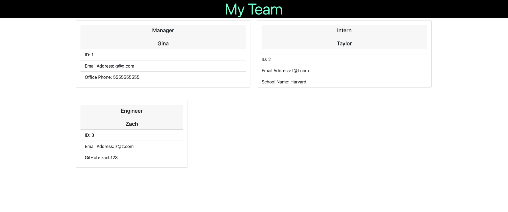
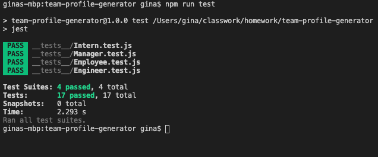

# team-profile-generator

# Team Profile Generator 

Team Profile Generator is an application that takes information about your team that includes 
* Position
* Name 
* ID 

Each position has a unique information for example Managers infomation is 'Office Number', Intern is 'School Name', and Engineer is GitHub username. When you input each members information through node team.js an HTML file will generate with each members information. 

In the back-end, I started by constructing each role, then testing to ensure it all clears before moving on to the step. 

